<!--
  Personnel technical record REC-2025-PZ-001, the same document as the portfolio.
  The artwork in assets/ is generated by assets/build.py; edit the content there and rebuild.
  The cards sit in one HTML block with no blank lines, so GitHub stacks them as one sheet.
-->

<picture><source media="(prefers-color-scheme: dark)" srcset="assets/header-dark.svg"></picture>
<a href="https://piozac002.github.io/PortfolioPage/"><picture><source media="(prefers-color-scheme: dark)" srcset="assets/channel-portfolio-dark.svg"></picture></a><a href="https://www.linkedin.com/in/piotr-za%C4%87mi%C5%84ski-587263199"><picture><source media="(prefers-color-scheme: dark)" srcset="assets/channel-linkedin-dark.svg"></picture></a><a href="mailto:piotrek.zacminski2002@gmail.com"><picture><source media="(prefers-color-scheme: dark)" srcset="assets/channel-email-dark.svg"></picture></a>
<picture><source media="(prefers-color-scheme: dark)" srcset="assets/parity-dark.svg"></picture>
<picture><source media="(prefers-color-scheme: dark)" srcset="assets/register-dark.svg"></picture>
<a href="https://tasksystem-frontend-687047392177.europe-west1.run.app/"><picture><source media="(prefers-color-scheme: dark)" srcset="assets/project-tasksystem-dark.svg"></picture></a>
<a href="https://barberappv2026.onrender.com/"><picture><source media="(prefers-color-scheme: dark)" srcset="assets/project-barberapp-dark.svg"></picture></a>
<a href="https://hala-4.onrender.com/"><picture><source media="(prefers-color-scheme: dark)" srcset="assets/project-hala4-dark.svg"></picture></a>
<a href="https://piozac002.github.io/PortfolioPage/"><picture><source media="(prefers-color-scheme: dark)" srcset="assets/project-portfolio-dark.svg"></picture></a>
<a href="https://github.com/PioZac002/TaskSystemm"><picture><source media="(prefers-color-scheme: dark)" srcset="assets/source-tasksystem-dark.svg"></picture></a><a href="https://github.com/PioZac002/BarberAppv2"><picture><source media="(prefers-color-scheme: dark)" srcset="assets/source-barberapp-dark.svg"></picture></a><a href="https://github.com/PioZac002/hala-4"><picture><source media="(prefers-color-scheme: dark)" srcset="assets/source-hala4-dark.svg"></picture></a><a href="https://github.com/PioZac002/PortfolioPage"><picture><source media="(prefers-color-scheme: dark)" srcset="assets/source-portfolio-dark.svg"></picture></a>
<picture><source media="(prefers-color-scheme: dark)" srcset="assets/stack-dark.svg"></picture>
<picture><source media="(prefers-color-scheme: dark)" srcset="assets/qualifications-dark.svg"></picture>
<picture><source media="(prefers-color-scheme: dark)" srcset="assets/footer-dark.svg"></picture>

