<!--
  Personnel technical record REC-2025-PZ-001, the same document as the portfolio.
  The artwork in assets/ is generated by assets/build.py; edit the content there and rebuild.
-->

<picture>
  <source media="(prefers-color-scheme: dark)" srcset="assets/header-dark.svg">
  
</picture>

<a href="https://piozac002.github.io/PortfolioPage/"><b>Portfolio</b></a>
&nbsp;·&nbsp;
<a href="https://www.linkedin.com/in/piotr-za%C4%87mi%C5%84ski-587263199"><b>LinkedIn</b></a>
&nbsp;·&nbsp;
<a href="mailto:piotrek.zacminski2002@gmail.com"><b>piotrek.zacminski2002@gmail.com</b></a>

  

<picture>
  <source media="(prefers-color-scheme: dark)" srcset="assets/parity-dark.svg">
  
</picture>

<picture>
  <source media="(prefers-color-scheme: dark)" srcset="assets/register-dark.svg">
  
</picture>
<a href="https://tasksystem-frontend-687047392177.europe-west1.run.app/"><picture>
  <source media="(prefers-color-scheme: dark)" srcset="assets/project-tasksystem-dark.svg">
  
</picture></a>
<a href="https://barberappv2026.onrender.com/"><picture>
  <source media="(prefers-color-scheme: dark)" srcset="assets/project-barberapp-dark.svg">
  
</picture></a>
<a href="https://hala-4.onrender.com/"><picture>
  <source media="(prefers-color-scheme: dark)" srcset="assets/project-hala4-dark.svg">
  
</picture></a>
<a href="https://piozac002.github.io/PortfolioPage/"><picture>
  <source media="(prefers-color-scheme: dark)" srcset="assets/project-portfolio-dark.svg">
  
</picture></a>

Source code:
<a href="https://github.com/PioZac002/TaskSystemm">TaskSystem</a> ·
<a href="https://github.com/PioZac002/BarberAppv2">BarberApp</a> ·
<a href="https://github.com/PioZac002/hala-4">Hala 4</a> ·
<a href="https://github.com/PioZac002/PortfolioPage">Portfolio</a>
 The demos run on free tiers, so the first visit can take up to a minute while the service wakes up.

  

<picture>
  <source media="(prefers-color-scheme: dark)" srcset="assets/stack-dark.svg">
  
</picture>

<b>§4 Qualifications</b> · degree, six courses, languages

 

| | |
|---|---|
| **B.Eng. in Applied Computer Science** | Politechnika Bydgoska im. Jana i Jędrzeja Śniadeckich, 09.2021 - 03.2025 |
| Agile Project Management - AgilePM® Foundation | Centrum Szkoleniowe ProcessTeam |
| Complete React, Next.js & TypeScript Projects Course 2025 | Udemy - Jānis Smilga |
| MERN 2025 Edition - MongoDB, Express, React and NodeJS | Udemy - Jānis Smilga |
| NodeJS Tutorial and Projects Course | Udemy - Jānis Smilga |
| JavaScript Tutorial and Projects Course | Udemy - Jānis Smilga |
| HTML/CSS Tutorial and Projects Course | Udemy - Jānis Smilga |

Languages: Polish (native), English (B2+/C1), German (A2).

<picture>
  <source media="(prefers-color-scheme: dark)" srcset="assets/footer-dark.svg">
  
</picture>

